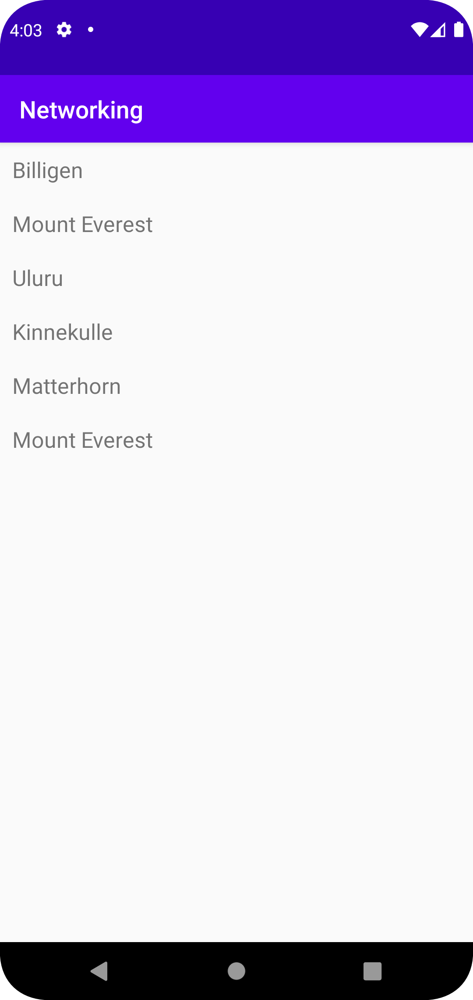

# Rapport

Detta är rapporten för Networking

I activity_main.xml lade det till en recyclerview.
```
<androidx.recyclerview.widget.RecyclerView
        android:id="@+id/recycler_view"
        android:layout_width="match_parent"
        android:layout_height="match_parent"
        app:layout_constraintBottom_toBottomOf="parent"
        app:layout_constraintLeft_toLeftOf="parent"
        app:layout_constraintRight_toRightOf="parent"
        app:layout_constraintTop_toTopOf="parent" />
```

En ny xml fill lades till för att visa hur elementen i recyclerview ska se ut.
```
<?xml version="1.0" encoding="utf-8"?>
<LinearLayout xmlns:android="http://schemas.android.com/apk/res/android"
    android:layout_width="match_parent"
    android:layout_height="wrap_content"
    android:orientation="horizontal"
    android:padding="10dp">

    <TextView
        android:id="@+id/title"
        android:layout_width="wrap_content"
        android:layout_height="wrap_content"
        android:textSize="18sp"/>

</LinearLayout>
```

Mountain class var skapad and given geters and seters.
```
public class Mountain {

    private String name;
    @SerializedName("location")
    private String place;
    @SerializedName("size")
    private int hight;

    public Mountain(String name){
        this.name = name;
    }

    public void setName(String name) {
        this.name = name;
    }
```

I mainActivity.java sättes en arraylist av mountains, RecyclerViewAdaptern skapades
och recView sates som RecyclerView.
```
Mountains = new ArrayList<>(Arrays.asList(
    new Mountain("Billigen"),
    new Mountain("Mount Everest"),
    new Mountain("Uluru")
));

recViewAdapter = new RecyclerViewAdapter(this, Mountains);

recView = findViewById(R.id.recycler_view);
recView.setLayoutManager(new LinearLayoutManager(this));
recView.setAdapter(recViewAdapter);
```

RecycelViewAdapter.java kopierades från guiden och allt om onclick togs bort
och en update metod skapades.
```
public class ViewHolder extends RecyclerView.ViewHolder {
    TextView title;

    ViewHolder(View itemView) {
        super(itemView);
        title = itemView.findViewById(R.id.title);
    }
}

public void updateAdapter(ArrayList<Mountain> newItems){
    items.addAll(newItems);
}

```

Till sista så lades det till i onPostExecute i mainActivity.java så bergen från JSON mappen 
läggs till i listan av berg.
```
Type type = new TypeToken<ArrayList<Mountain>>() {}.getType();
ArrayList<Mountain> listOfMountains = gson.fromJson(json, type);

recViewAdapter.updateAdapter(listOfMountains);
recViewAdapter.notifyDataSetChanged();
```

på grund av firewall så gorde jag inte JSON hämtningen från websidan.


